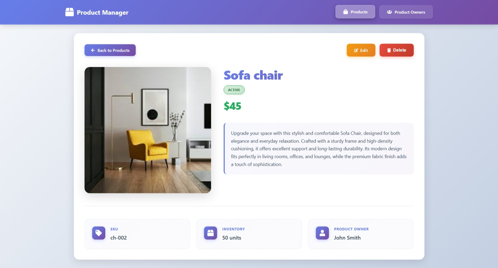
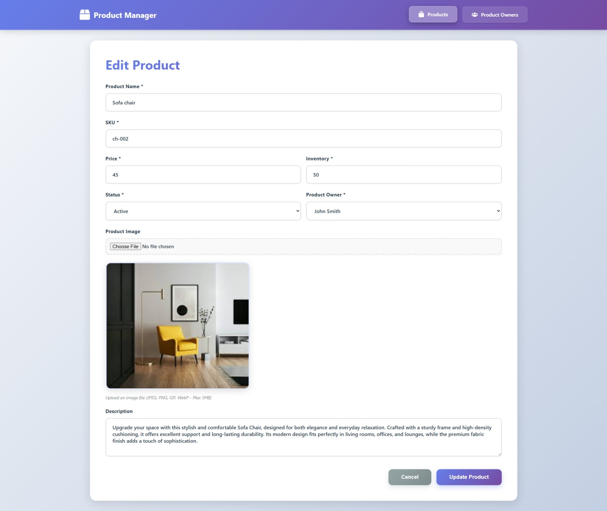

# Operations Products Management System

A full-stack TypeScript web application for managing products and product owners with CRUD functionality, filtering, pagination, and a modern user interface.

## Features

- Full CRUD operations for products and product owners
- Image upload with local file storage
- Search by product name or SKU
- Filter by status, owner, and price range
- Sort by multiple fields
- Pagination with customizable page size
- Responsive design for all screen sizes
- Form validation and error handling

## Screenshots

### Products Landing Page


### Product Details Page


### Create New Product


### Edit Product


### Product Owners Page


## Technology Stack

### Frontend
- React 18 with TypeScript
- React Router DOM
- Axios
- React Icons

### Backend
- Node.js with Express
- TypeScript
- Sequelize ORM
- PostgreSQL
- Multer for file uploads

## Installation

### Prerequisites
- Node.js (v14 or higher)
- PostgreSQL (v12 or higher)

### Database Setup

1. Create PostgreSQL database:
```sql
CREATE DATABASE products_db;
```

### Backend Setup

1. Navigate to backend directory:
```bash
cd backend
```

2. Install dependencies:
```bash
npm install
```

3. Create `.env` file:
```env
DB_HOST=localhost
DB_PORT=5432
DB_NAME=products_db
DB_USER=your_postgres_user
DB_PASSWORD=your_postgres_password
PORT=3001
NODE_ENV=development
```

4. Start the server:
```bash
npm run dev
```

Backend runs on `http://localhost:3001`

### Frontend Setup

1. Navigate to frontend directory:
```bash
cd frontend
```

2. Install dependencies:
```bash
npm install
```

3. Start the development server:
```bash
npm start
```

Frontend runs on `http://localhost:3000`

## Project Structure

```
product-mangment/
├── frontend/          # React + TypeScript frontend
│   ├── src/
│   │   ├── components/    # UI components
│   │   ├── pages/         # Page components
│   │   ├── services/      # API services
│   │   └── types/         # TypeScript types
│   └── package.json
│
├── backend/           # Node.js + TypeScript backend
│   ├── src/
│   │   ├── config/        # Database config
│   │   ├── controllers/   # Request handlers
│   │   ├── models/        # Sequelize models
│   │   ├── routes/        # API routes
│   │   ├── middleware/    # Custom middleware
│   │   └── scripts/       # Seed scripts
│   ├── uploads/           # Uploaded images
│   └── package.json
│
└── samples/          # Screenshot images
```


## Development

### Backend Commands
- `npm run dev` - Start development server
- `npm run build` - Build TypeScript
- `npm run seed` - Run seed script

### Frontend Commands
- `npm start` - Start development server
- `npm run build` - Build for production

